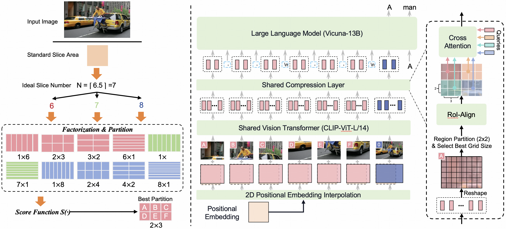

<div align="center">
  
# LLaVA-UHD

**A Large Multimodal Model Perceiving Any Aspect Ratio and High-Resolution Images**
</div>

This repository hosts the code, data, and model weight of **LLaVA-UHD**, a novel framework that enables Large Multimodal Models (LMMs) to efficiently perceive images in any aspect ratio and high resolution. Notably, our model built on LLaVA-1.5 336×336 supports 6 times
larger (i.e., 672×1088) resolution images and achieves 5.7 accuracy improvement on TextVQA. Moreover, the model can be efficiently trained in academic settings, within ~1 day on 8 A100 GPUs. Visit our 📃 [paper](https://arxiv.org/pdf/2403.11703.pdf) here!


## Overview



LLaVA-UHD includes three key components to deal with native-resolution images: 

-  An image modularization strategy that divides native-resolution images into smaller variable-sized
slices for efficient and extensible encoding.

-  A novel compression module (**spatially constrained resampler**) that further condenses image tokens from visual encoders.

-  A spatial schema to organize
slice tokens for LLMs. Comprehensive experiments show that LLaVA-UHD out-
performs established LMMs trained with 2-3 orders of magnitude more data on
8 benchmarks. 

## Release
-[2024/07/29] 🔥LLaVA-UHD achieves performance improvement on 8 common benchmarks beyong LLaVA-1.5. 
              Our novel projector, **spatially constrained resampler**, realizes high feature compression and convergence efficiency. 
              Model checkpoints are available in [hugging-face](https://huggingface.co/guozonghao96/llava-uhd-144-13b).

-[2024/07/01] 📢[LLaVA-UHD](https://arxiv.org/pdf/2403.11703.pdf) is accepted by ECCV2024.

## Environment Preparing
1. To reproduce the results of the paper, please set up the Python environment using the following code:
```bash
conda create -n llava-uhd python=3.10
conda activate llava-uhd
pip install -r requirements.txt
sh install.sh
```

2. Download the checkpoints of [CLIP-ViT-L/14](https://huggingface.co/openai/clip-vit-large-patch14-336) 
   and [Vicuna-13B-v1.5](https://huggingface.co/lmsys/vicuna-13b-v1.5). And put them into ```./pretrained_models```

If something wrong happens, please kindly refer to the issues of [LLaVA](https://github.com/haotian-liu/LLaVA/issues) 
or submit issues in our repository.

## Data Preparing
1. **Pretraining Data**: Download the 558K subset of the LAION-CC-SBU dataset with BLIP captions we use in the paper [here](https://huggingface.co/datasets/liuhaotian/LLaVA-Pretrain).
And put the data into ```./playground/data```. Also could refer to the documentation of [LLaVA](https://github.com/haotian-liu/LLaVA) for detailed data organization.
2. **Fine-tuning Data**: Please download the annotation of the final mixture our instruction tuning data [llava_v1_5_mix665k.json](https://huggingface.co/datasets/liuhaotian/LLaVA-Instruct-150K/blob/main/llava_v1_5_mix665k.json), and download the images from constituting datasets:
    - COCO: train2017
    - GQA: images
    - OCR-VQA: download script, we save all files as .jpg
    - TextCaps: train_val_images
    - VisualGenome: part1, part2

    Download dataset images as in the finetuning process of LLaVA-1.5, place them in the ```./playground/data```
## Training Script
Please refer to train.sh for pretraining script and fine-tuning script (we comment in the file). 
If you want to do end-to-end pretraining, fine-tuning and evalutation, please run the following command.

```bash
sh train.sh
```

## Evaluation Code
Evaluation script is in eval.sh, you can run 
```bash
sh eval.sh dir_name_in_checkpoints_new
# e.g. sh eval.sh llava-uhd-144-13b
# llava-uhd-144-13b is the dir_name stored in the path of ./checkpoints_new
```
For details of data organization, please refer to [here](https://github.com/haotian-liu/LLaVA/blob/main/docs/Evaluation.md) for help. 
We provide the same script to complete the testing.

## Citation

If you find LLaVA-UHD useful for your research and applications, please cite using this BibTeX:
```bibtex
@article{guo2024llava-uhd,
  title={{LLaVA-UHD}: an LMM Perceiving Any Aspect Ratio and High-Resolution Images},
  author={Guo, Zonghao and Xu, Ruyi and Yao, Yuan and Cui, Junbo and Ni, Zanlin and Ge, Chunjiang and Chua, Tat-Seng and Liu, Zhiyuan and Huang, Gao},
  journal={arXiv preprint arXiv:2403.11703},
  year={2024}
}
```