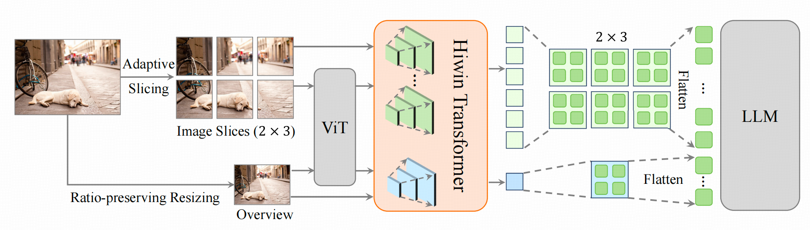
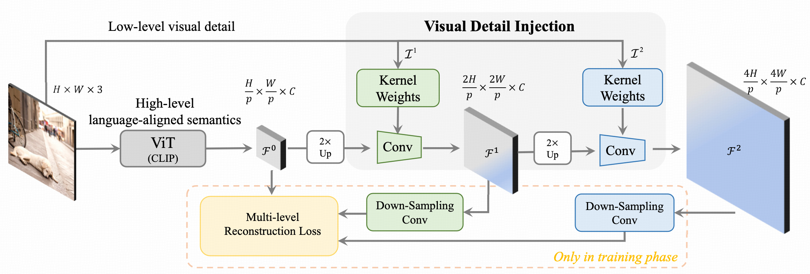
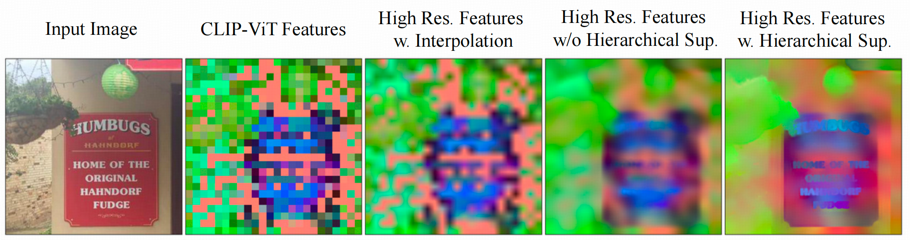
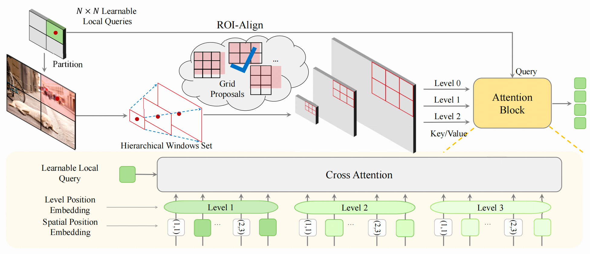

<div align="center">
  
# LLaVA-UHD v2

**LLaVA-UHD v2: an MLLM Integrating
High-Resolution Feature Pyramid via Hierarchical
Window Transformer**
</div>

This repository hosts the code, data, and model weight of **LLaVA-UHD v2**, an advanced MLLM centered around a Hierarchical window transformer that enables capturing diverse visual granularity by constructing and integrating a high resolution feature pyramid. 
Notably, our model built on **LLaVA-UHD**, brings an average boost of 3.7% across 14 benchmarks compared with the baseline
method, 9.3% on DocVQA for instance. 
Visit our 📃 [paper](https://arxiv.org/pdf/2412.13871) here!


## Overview



LLaVA-UHD v2 includes two key components: 

(i) an inverse feature pyramid, constructed by
a ViT-derived feature up-sampling process utilizing high-frequency details from
an image pyramid



(ii) **hierarchical window attention**, focusing on a set of
key sampling features within cross-scale windows to condense multi-level feature
maps. 


## Release
-[2024/12/19] 🔥LLaVA-UHD v2 achieves achieves superior
performance over existing MLLMs on 13 popular benchmarks. 
Notably, our design
brings an average boost of 3.7% across 14 benchmarks compared with the baseline
method(LLaVA-UHD), 9.3% on DocVQA for instance.
 [Model checkpoints](https://huggingface.co/YipengZhang/LLaVA-UHD-v2) and [LLaVA-UHD-v2-SFT-Data](https://huggingface.co/datasets/YipengZhang/LLaVA-UHD-v2-SFT-Data) are available in huggingface.

-[2024/07/29] LLaVA-UHD achieves performance improvement on 8 common benchmarks beyong LLaVA-1.5. 
Our novel projector, **spatially constrained resampler**, realizes high feature compression and convergence efficiency. 
Model checkpoints are available in [hugging-face](https://huggingface.co/guozonghao96/llava-uhd-144-13b).
You can find the original project instruction and code of **LLaVA-UHD** in branch `LLaVA-UHD-v1`

-[2024/07/01] 📢[LLaVA-UHD](https://www.ecva.net/papers/eccv_2024/papers_ECCV/papers/11080.pdf) is accepted by ECCV2024.

## Environment Preparing
1. To reproduce the results of the paper, please set up the Python environment using the following code:
```bash
conda create -n llava-uhd python=3.10
conda activate llava-uhd
sh install.sh
```

2. Download the checkpoints of [CLIP-ViT-L/14-336](https://huggingface.co/openai/clip-vit-large-patch14-336) and [Vicuna-7B-v1.5](https://huggingface.co/lmsys/vicuna-7b-v1.5). And put them into ```./pretrained_models```. In the checkpoint path of vicuna-7b-v1.5, set 'do_sample' in 'generation_config.json' as 'True', otherwise there is an error when saving training checkpoint.

If something wrong happens, please kindly refer to the issues of [LLaVA](https://github.com/haotian-liu/LLaVA/issues) 
or submit issues in our repository.

## Data Preparing
1. **JBU module pre-training Data**:
Download MS-COCO stuff 2017.
2. **Pretraining Data**: Download the 558K subset of the LAION-CC-SBU dataset with BLIP captions we use in the paper [here](https://huggingface.co/datasets/liuhaotian/LLaVA-Pretrain).
And put the data into ```./playground/data```. Also could refer to the documentation of [LLaVA](https://github.com/haotian-liu/LLaVA) for detailed data organization.
3. **Fine-tuning Data**: Please download the annotation of the final mixture our instruction tuning data [llava-uhd-v2-sft-data.json](https://huggingface.co/datasets/YipengZhang/LLaVA-UHD-v2-SFT-Data/llava-uhd-v2-sft-data.json), and download the datasets[LLaVA-UHD-v2-SFT-Data](https://huggingface.co/datasets/YipengZhang/LLaVA-UHD-v2-SFT-Data), place them in the ```./playground/data```

## Training Script
1. **JBU module pre-training**:
Please use jbu-pretrain.sh, and all hyper parameters are in ```./featup/configs/jbu_upsampler.yaml```. You can directly use our pretrained [JBU module](https://huggingface.co/YipengZhang/LLaVA-UHD-v2/clip-large-jbu.ckpt) of CLIP-ViT-L/14-336.
```bash
sh jbu-pretrain.sh
```
2. **model training**:
Please refer to train.sh for pretraining script and fine-tuning script (we comment in the file). 
If you want to do end-to-end pretraining, fine-tuning and evalutation, please run the following command.
You can directly use our pretrained [multimodal_projector](https://huggingface.co/YipengZhang/LLaVA-UHD-v2/mm_projector.bin).

```bash
sh model-train.sh
```

## Evaluation
**1. Evaluation script**:
We use evaluation scripts to evaluate **MME, AI2D, DocVQA, ChartVQA, TextVQA, GQA, SciQA-IMG**.
You can run evaluation scripts in eval.sh:
```bash
sh eval.sh dir_name_in_checkpoints_new
# e.g. sh eval.sh llava-uhd-144-7b
# llava-uhd-144-7b is the dir_name stored in the path of ./checkpoints_new
```
For details of data organization, please refer to [here](https://github.com/haotian-liu/LLaVA/blob/main/docs/Evaluation.md) for help. 
We provide the same script to complete the testing.

**2. VLMEvalKit**:
We use [VLMEvalKit](https://github.com/open-compass/VLMEvalKit) to evaluete **OCR-Bench, MMMU-val, SEED-Image, MMB, RealWorldQA, HR-Bench**. We integrate VLMEvalKit into this repository for better reproducibility.


## LLaVA-UHD v1
For using **LLaVA-UHD v1**, You can follow the original project instruction and code of **LLaVA-UHD v1** in branch `LLaVA-UHD-v1`, or just set the following hyper paramerters in training script to change training mode to **LLaVA-UHD v1**.

```bash
--mm_projector_type adapt_spatial_resampler_v1
--feature_mode uhd_v1
```


## Citation
If you find LLaVA-UHD v2 useful for your research and applications, please cite using this BibTeX:
```bibtex
@article{zhang2024llavauhdv2mllmintegrating,
  title={LLaVA-UHD v2: an MLLM Integrating High-Resolution Feature Pyramid via Hierarchical Window Transformer},
  author={Yipeng Zhang and Yifan Liu and Zonghao Guo and Yidan Zhang and Xuesong Yang and Chi Chen and Jun Song and Bo Zheng and Yuan Yao and Zhiyuan Liu and Tat-Seng Chua and Maosong Sun},
  journal={arXiv preprint arXiv:2412.13871},
  year={2024}
}
```

