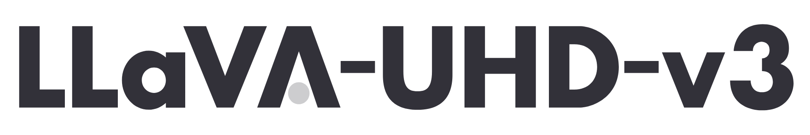
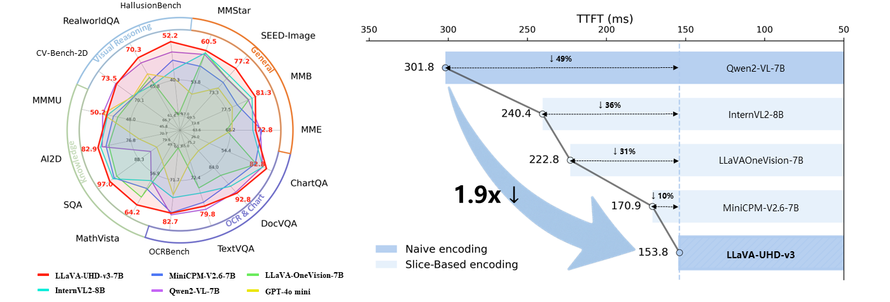
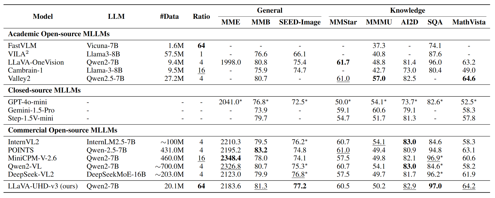
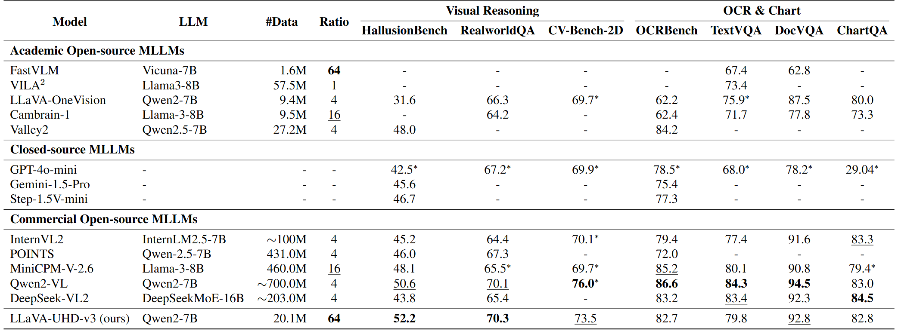
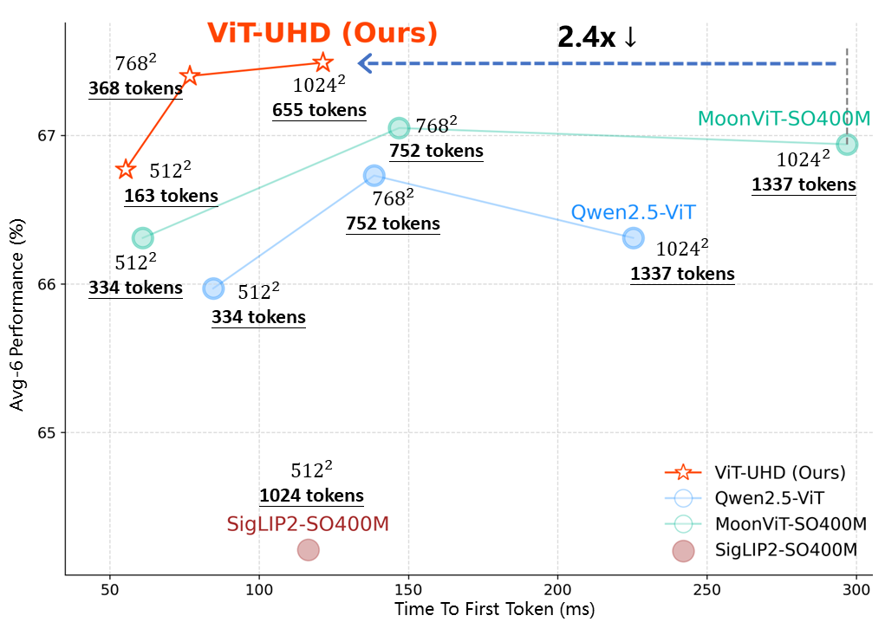
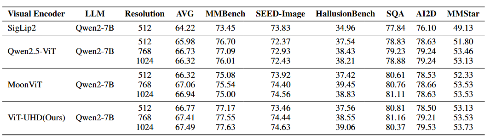
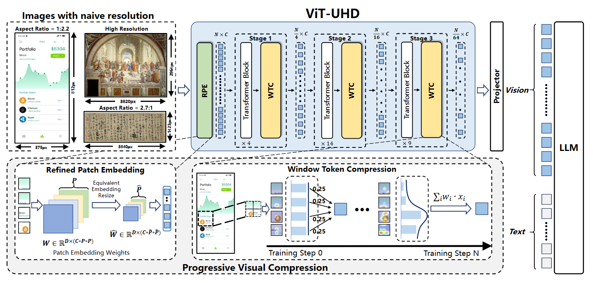

<div align="center">
  


**LLaVA-UHD-v3: PROGRESSIVE VISUAL COMPRES-SION FOR EFFICIENT NAIVE-RESOLUTION ENCODING IN MLLMS**

<p align="center">
🤗 <a href="https://huggingface.co/Sishxo/LLaVA-UHD-v3"> HuggingFace Models</a>&nbsp&nbsp | &nbsp&nbsp📄 <a href="https://arxiv.org/abs/2511.21150">Arxiv</a>
</p>
</div>


This repository hosts the code, data of **LLaVA-UHD-v3**, a multimodal large language model (MLLM) built upon our proposed Progressive Visual Compression (PVC) for efficient naive-resolution encoding. Our model not only achieves performance comparable to advanced MLLMs like Qwen2-VL across 15 diverse benchmarks but also delivers a 1.9x reduction in Time-to-First-Token (TTFT). Moreover, LLaVA-UHD v3 can be trained efficiently in academic settings, requiring approximately 300 hours on 32 A100 GPUs. For more details, please visit our 📃 [paper](https://arxiv.org/abs/2511.21150) here

## News
-[2025/11/27] 🧠The Pilot experiment related code of LLaVA-UHD-v3 and benchmark mentioned in the paper are available on [huggingface](https://huggingface.co/datasets/ZzzHelloWorld/LLaVA-UHD-v3_Pilot_experiment).The checkpoints for global naive-resolution visual encoding GNE and slice-based encoding SBE have also been released.

-[2025/11/27] 🔥**LLaVA-UHD v3** achieves a superior trade-off between efficiency and performance across 15 diverse benchmarks. Our novel vision encoder, ViT-UHD with Progressive Visual Compression (PVC), enables efficient naive-resolution encoding, significantly reducing latency while maintaining competitive performance. Model checkpoints are available in [huggingface](https://huggingface.co/Sishxo/LLaVA-UHD-v3).

-[2025/11/08] 📢🔥 LLaVA-UHD v2 is accepted by [AAAI-26](https://arxiv.org/abs/2412.13871).

-[2025/04/01] 🔥We released new checkpoints of LLaVA-UHD v2 based on [Qwen2.0-7B-instruct](https://huggingface.co/YipengZhang/LLaVA-UHD-v2-Qwen2.0-7B) and [Vicuna-13B](https://huggingface.co/YipengZhang/LLaVA-UHD-v2-Vicuna-13B).

-[2024/12/19] 🔥**LLaVA-UHD v2** achieves superior
performance over existing MLLMs on 15 popular benchmarks. 
Notably, our design
brings an average boost of 3.7% across 14 benchmarks compared with the baseline
method(LLaVA-UHD), 9.3% on DocVQA for instance.
 [Model checkpoints](https://huggingface.co/YipengZhang/LLaVA-UHD-v2) and [LLaVA-UHD-v2-SFT-Data](https://huggingface.co/datasets/YipengZhang/LLaVA-UHD-v2-SFT-Data) are available in huggingface.

-[2024/07/29] **LLaVA-UHD** achieves performance improvement on 8 common benchmarks beyong LLaVA-1.5. 
Our novel projector, **spatially constrained resampler**, realizes high feature compression and convergence efficiency. 
Model checkpoints are available in [huggingface](https://huggingface.co/guozonghao96/llava-uhd-144-13b).
You can find the original project instruction and code of **LLaVA-UHD** in branch `LLaVA-UHD-v1`

-[2024/07/01] 📢[LLaVA-UHD](https://www.ecva.net/papers/eccv_2024/papers_ECCV/papers/11080.pdf) is accepted by ECCV2024.

## Performance

#### LLaVA-UHD-v3







#### ViT-UHD
<p align="center">
  
  
</p>

## Highlights



🧠 **Progressive Visual Compression (PVC)**: LLaVA-UHD v3 introduces a novel visual encoding strategy for efficient naive-resolution processing in MLLMs, combining fine-grained tokenization with hierarchical compression.

💡 **Refined Patch Embedding (RPE)**: Flexibly scales patch sizes to produce detailed visual tokens while maintaining full compatibility with pretrained Vision Transformers, enabling richer visual representations.

💡 **Windowed Token Compression (WTC)**: Progressively merges local token representations within the vision encoder, reducing sequence length and computational cost without losing holistic visual context.

🏆 **Preserved Holistic Understanding**: Unlike slice-based approaches, PVC maintains full-scene semantics, preventing fragmented interpretations common in other naive-resolution encoding methods.

⚡ **Efficient and Competitive**: Achieves strong performance on a wide range of vision-language benchmarks, rivaling state-of-the-art models like Qwen2-VL, while significantly lowering inference latency.

This repository provides examples, usage instructions, and best practices to help developers leverage LLaVA-UHD v3 for efficient, high-fidelity vision-language tasks.


## Quick Start
```
pip install "transformers>=4.51.0"
```

We adapt our model with ```transformers```, here we show a example of how to chat with our **LLaVA-UHD-v3** conveniently.
#### Using 🤗 Transformers to Chat
```
from transformers import AutoModelForCasualLM, AutoProcessor

# default: Load the model on the available device(s)
model = AutoModelForImageTextToText.from_pretrained(
    "Sishxo/LLaVA-UHD-v3", dtype="auto", device_map="auto"
)

# We recommend enabling flash_attention_2 for better acceleration and memory saving, especially in multi-image and video scenarios.
# model = AutoModelForImageTextToText.from_pretrained(
#     "Sishxo/LLaVA-UHD-v3",
#     dtype=torch.bfloat16,
#     attn_implementation="flash_attention_2",
#     device_map="auto",
# )

processor = AutoProcessor.from_pretrained("Sishxo/LLaVA-UHD-v3")

messages = [
    {
        "role": "user",
        "content": [
            {"type": "image", "image": "file:///path/to/your/image.jpg"},
            {"type": "text", "text": "Describe this image."},
        ],
    }
]

# Preparation for inference
inputs = processor.apply_chat_template(
    messages,
    tokenize=True,
    add_generation_prompt=True,
    return_dict=True,
    return_tensors="pt"
)
inputs = inputs.to(model.device)

# Inference: Generation of the output
generated_ids = model.generate(**inputs, max_new_tokens=128)
generated_ids_trimmed = [
    out_ids[len(in_ids) :] for in_ids, out_ids in zip(inputs.input_ids, generated_ids)
]
output_text = processor.batch_decode(
    generated_ids_trimmed, skip_special_tokens=True, clean_up_tokenization_spaces=False
)
print(output_text)
```

#### Evaluation

1. Run setup script using the following code:
   ```
    conda create -n LLaVA-UHD-v3-eval python=3.10
    conda activate LLaVA-UHD-v3-eval
    bash setup_eval_env.sh
   ```
2. Run eval script:
    ```
      bash eval.sh
    ```


Evaluation script is in VLMEvalkit, you need to add the corresponding files to the official VLMEvalkit project for testing.

For details of data organization, please refer to [here](https://github.com/open-compass/VLMEvalKit) for help. 
We provide the same script to complete the testing.


#### Training and Fine-tuning

1. Download the flashattention wheel:[flash_attn-2.7.0](https://github.com/Dao-AILab/flash-attention/releases/download/v2.7.0.post1/flash_attn-2.7.0.post1+cu12torch2.1cxx11abiFALSE-cp310-cp310-linux_x86_64.whl)

2. Download the checkpoints of [ViT-UHD](https://huggingface.co/ZzzHelloWorld/moonvit-so-400m-4-18-se-hirope2d-p10) and checkpoints of [Qwen2-7B](https://huggingface.co/Qwen/Qwen2-7B-Instruct).


3. Run setup script using the following code:
    ```bash
    conda create -n LLaVA-UHD-v3 python=3.10
    conda activate LLaVA-UHD-v3
    bash setup_train_env.sh
    ```

4. Please refer to train.sh for pretraining script and fine-tuning script (we comment in the file), and prepare training data as the [llava data format](https://huggingface.co/datasets/YipengZhang/LLaVA-UHD-v2-SFT-Data).

    ```bash
    sh train.sh
    ```


## Citation

If you find LLaVA-UHD-v3 useful for your research and applications, please cite using this BibTeX:
```bibtex
@misc{sun2025llavauhdv3progressivevisual,
      title={LLaVA-UHD v3: Progressive Visual Compression for Efficient Native-Resolution Encoding in MLLMs}, 
      author={Shichu Sun and Yichen Zhang and Haolin Song and Zonghao Guo and Chi Chen and Yidan Zhang and Yuan Yao and Zhiyuan Liu and Maosong Sun},
      year={2025},
      eprint={2511.21150},
      archivePrefix={arXiv},
      primaryClass={cs.CV},
      url={https://arxiv.org/abs/2511.21150}, 
}
@article{zhang2024llavauhdv2,
  title={LLaVA-UHD v2: an MLLM Integrating High-Resolution Feature Pyramid via Hierarchical Window Transformer},
  author={Yipeng Zhang and Yifan Liu and Zonghao Guo and Yidan Zhang and Xuesong Yang and Chi Chen and Jun Song and Bo Zheng and Yuan Yao and Zhiyuan Liu and Tat-Seng Chua and Maosong Sun},
  journal={arXiv preprint arXiv:2412.13871},
  year={2024}
}
@inproceedings{guo2024llava-uhd,
  title={{LLaVA-UHD}: an LMM Perceiving Any Aspect Ratio and High-Resolution Images},
  author={Guo, Zonghao and Xu, Ruyi and Yao, Yuan and Cui, Junbo and Ni, Zanlin and Ge, Chunjiang and Chua, Tat-Seng and Liu, Zhiyuan and Huang, Gao},
  booktitle={ECCV},
  year={2024}
}
```

